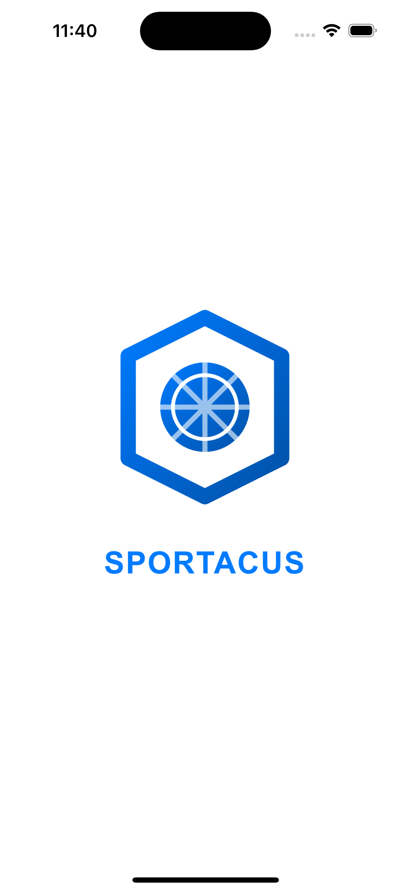
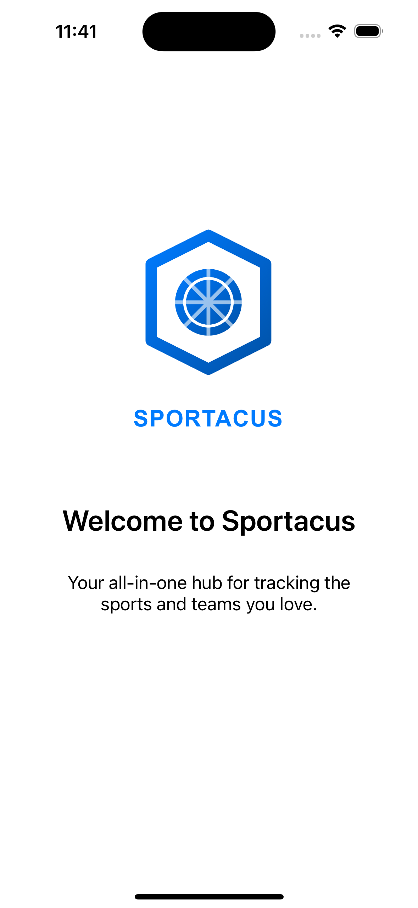
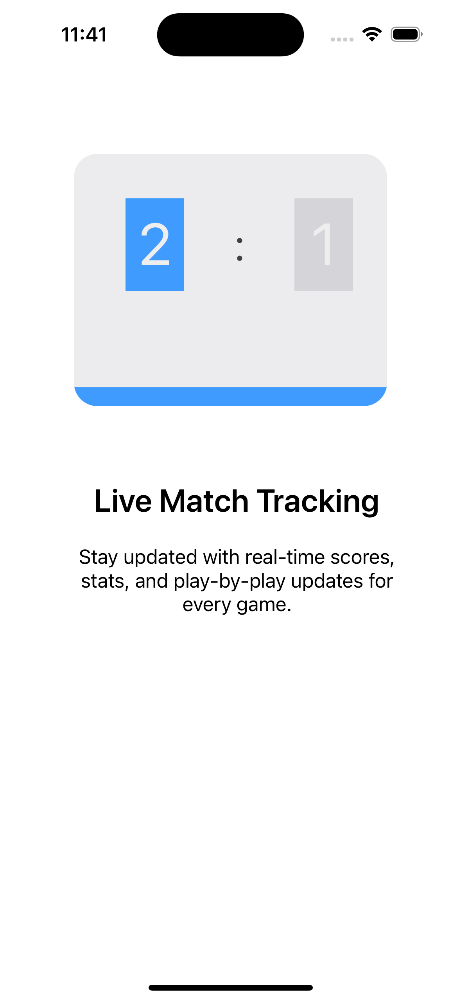
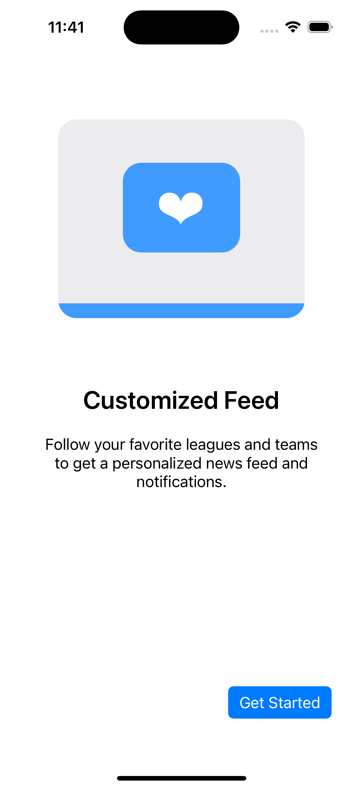
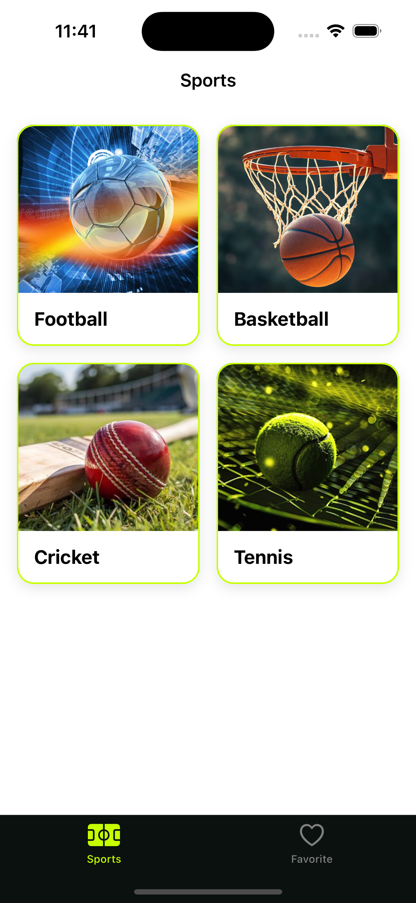
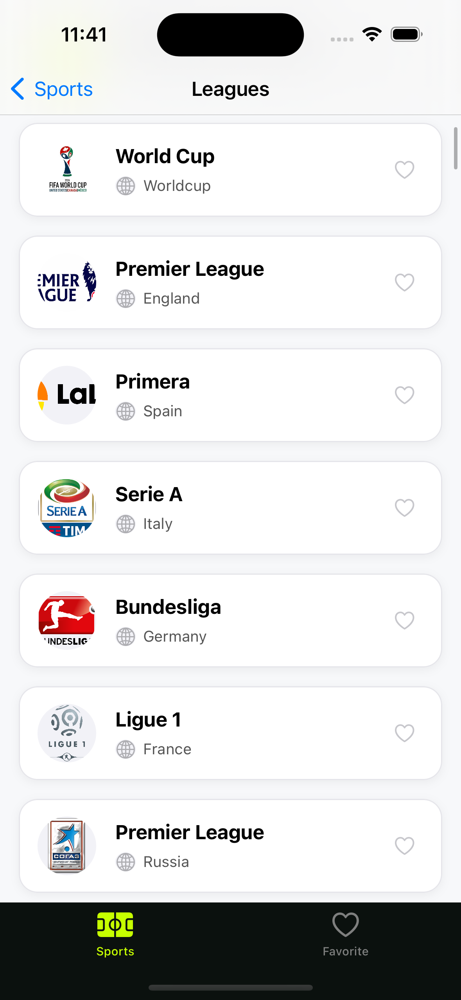
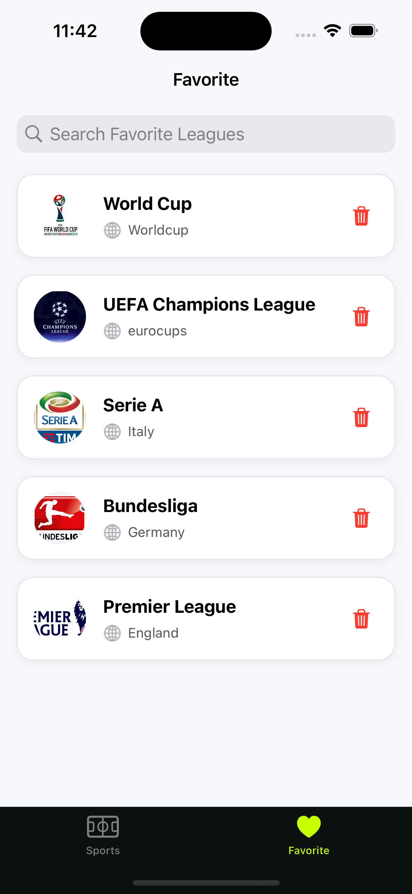

<p align="center">
  
</p>

<h1 align="center">⚽ Sportacus — Sports Tracker iOS App</h1>

<p align="center">
  <strong>Your all-in-one sports companion for Football, Basketball, Cricket & Tennis</strong>
</p>

<p align="center">
  
  
  
  
  
  
</p>

---

## 📖 Table of Contents

- [Overview](#-overview)
- [Features](#-features)
- [Screenshots](#-screenshots)
- [Architecture](#-architecture)
- [Project Structure](#-project-structure)
- [Tech Stack](#-tech-stack)
- [API](#-api)
- [Data Models](#-data-models)
- [CoreData Schema](#-coredata-schema)
- [Network Layer](#-network-layer)
- [Unit Testing](#-unit-testing)
- [Getting Started](#-getting-started)
- [Team Members](#-team-members)

---

## 🌟 Overview

**Sportacus** is a native iOS application built with Swift that lets users browse, explore, and track their favorite sports leagues and events across **4 major sports categories**: Football, Basketball, Cricket, and Tennis.

The app fetches live data from the [AllSportsAPI](https://allsportsapi.com), displays upcoming and latest events with scores, shows team/player rosters, and allows users to save their favorite leagues for quick access — even when offline.

---

## ✨ Features

### 🏠 Onboarding
- Beautiful **3-page onboarding** experience using `UIPageViewController`
- Onboarding state is **persisted in CoreData** — only shown once on first launch
- Smooth page transitions with "Get Started" CTA on the final page

### 🏟️ Sports Categories
- **4 supported sports**: Football ⚽, Basketball 🏀, Cricket 🏏, Tennis 🎾
- Premium card-based grid UI with sport-specific background images
- Rounded corners, drop shadows, and neon-green accent borders for a polished look

### 📋 Leagues List
- Browse all available leagues for each sport
- **Real-time search** — filter leagues by name or country
- **Favorite toggle** — add/remove leagues from favorites directly with a heart button
- Custom `LeagueTableViewCell` with league badge, country info, and action buttons
- Asynchronous image loading with **in-memory caching** (`NSCache`)

### 📊 League Details
- Detailed view for any selected league with **3 sections**:
  1. **Upcoming Events** — horizontal scrollable collection view with match cards showing team logos, date & time
  2. **Latest Results** — vertical list with score capsules (dark background + neon green text) showing final results
  3. **Teams / Players** — horizontal scrollable collection view with circular team/player logos
- **Favorite button** in navigation bar (filled/unfilled heart) with confirmation alert for removal
- All 3 API calls (events upcoming, events past, teams) run **concurrently** using `DispatchGroup`

### 👤 Team Details
- Detailed team/player info page with:
  - Large circular logo with neon-green border
  - Coach name, player count, team ID
  - Premium card design with rounded corners and subtle shadows

### ❤️ Favorites
- Dedicated **Favorites tab** accessible from the tab bar
- Favorites are **persisted using CoreData** — survive app restarts
- **Search** through favorite leagues
- **Swipe-to-delete** with confirmation alert
- **Network-aware navigation** — shows "No Internet" alert if user tries to open league details while offline
- Auto-refreshes on every tab appearance via `viewWillAppear`

### 🌐 Network Monitoring
- Real-time internet connectivity monitoring using `NWPathMonitor`
- Graceful handling of offline state with user-friendly alerts

### 🎨 Design System
- **Color Palette**: Deep Forest Night (dark), Lime Neon (accent green), Pitch Turf Green, App Dark Gray
- **Premium UI elements**: Rounded corners (16pt), subtle drop shadows, SF Symbols icons
- **Light Mode** enforced via `Info.plist` (`UIUserInterfaceStyle: Light`)
- Consistent styling across the entire app with a sporty, modern aesthetic

---

## 📸 Screenshots

### Splash & Onboarding
| Splash | Onboarding 1 | Onboarding 2 | Onboarding 3 |
|:---:|:---:|:---:|:---:|
|  |  |  |  |

### Main App
| Sports Home | Leagues List | Favorites |
|:---:|:---:|:---:|
|  |  |  |

### League & Team Details
| League Details (Events) | League Details (Teams) | Team Details |
|:---:|:---:|:---:|
|  |  |  |

---

## 🏗️ Architecture

The app follows the **MVP (Model-View-Presenter)** architectural pattern:

```
┌─────────────────────────────────────────────────────┐
│                      VIEW                           │
│  (UIViewController / UITableViewController)         │
│  - Displays data                                    │
│  - Forwards user interactions to Presenter          │
│  - Conforms to ViewProtocol                         │
└────────────────────┬────────────────────────────────┘
                     │ (weak reference)
                     ▼
┌─────────────────────────────────────────────────────┐
│                   PRESENTER                         │
│  - Contains business logic                          │
│  - Calls NetworkService / CoreDataManager           │
│  - Updates View via ViewProtocol                    │
│  - Conforms to PresenterProtocol                    │
└────────────────────┬────────────────────────────────┘
                     │
                     ▼
┌─────────────────────────────────────────────────────┐
│                    MODEL                            │
│  - Data structures (League, APIEvent, APITeam)      │
│  - API Response wrappers                            │
│  - CoreData Entities (FavouriteLeague, Onboarding)  │
└─────────────────────────────────────────────────────┘
```

### Contract Pattern (Protocols)
Each feature defines a **Contract** file containing two protocols:
- `ViewProtocol` — methods the Presenter calls on the View (e.g., `displayLeagues`, `showLoading`)
- `PresenterProtocol` — methods the View calls on the Presenter (e.g., `viewDidLoad`, `selectLeague`)

This ensures **clean separation of concerns** and makes the code highly **testable**.

---

## 📁 Project Structure

```
JETS-Sportacus-iOS/
├── Sportacus.xcodeproj/
├── sportacus/
│   ├── AppDelegate.swift                  # App lifecycle + CoreData stack
│   ├── SceneDelegate.swift                # Scene routing (Onboarding vs Main)
│   ├── ViewController.swift               # Base VC
│   ├── Info.plist                          # App configuration
│   │
│   ├── Features/
│   │   ├── Splash/
│   │   │   └── View/                      # Splash screen (empty — uses LaunchScreen.storyboard)
│   │   │
│   │   ├── Onboarding/
│   │   │   └── View/
│   │   │       ├── OnboardingPageViewController.swift   # UIPageViewController container
│   │   │       ├── FirstOnboardingViewController.swift   # Page 1
│   │   │       ├── SecondOnboardingViewController.swift  # Page 2
│   │   │       └── ThirdOnboardingViewController.swift   # Page 3 + "Get Started" action
│   │   │
│   │   ├── sports/
│   │   │   ├── presenter/
│   │   │   │   ├── SportsContract.swift          # View + Presenter protocols
│   │   │   │   └── SportsPresenter.swift         # Sports category logic
│   │   │   └── view/
│   │   │       ├── SportsViewController.swift    # 2x2 sports grid
│   │   │       └── SportCategoryCollectionViewCell.swift
│   │   │
│   │   ├── Leagues/
│   │   │   ├── presenter/
│   │   │   │   ├── LeaguesContract.swift         # Leagues protocols
│   │   │   │   ├── LeaguesPresenter.swift         # Leagues list logic
│   │   │   │   ├── LeagueDetailsContract.swift    # Details protocols + View Models
│   │   │   │   └── LeagueDetailsPresenter.swift   # Details logic (events + teams)
│   │   │   └── view/
│   │   │       ├── LeaguesTableViewController.swift        # Leagues list screen
│   │   │       ├── LeagueTableViewCell.swift               # League row cell
│   │   │       ├── LeagueDetailsViewController.swift       # Details screen
│   │   │       ├── UpcomingEventCollectionViewCell.swift    # Upcoming match card
│   │   │       ├── LatestEventCollectionViewCell.swift      # Score result card
│   │   │       ├── TeamCollectionViewCell.swift             # Team logo cell
│   │   │       └── TeamDetailsViewController.swift         # Team info page
│   │   │
│   │   └── Favorites/
│   │       ├── presenter/
│   │       │   ├── FavoritesContract.swift        # Favorites protocols
│   │       │   └── FavoritesPresenter.swift        # Favorites logic + FavoritesManager
│   │       └── view/
│   │           └── FavoritesTableViewController.swift      # Favorites screen
│   │
│   ├── Model/
│   │   └── Entities/
│   │       ├── League/
│   │       │   ├── League.swift                   # League data model (Codable)
│   │       │   └── LeaguesResponse.swift          # API response wrapper
│   │       └── Event/
│   │           ├── APIEvent.swift                 # Event data model (Codable)
│   │           └── EventResponse.swift            # API response wrapper
│   │
│   ├── Network/
│   │   ├── NetworkService.swift                   # Singleton API client + Team models
│   │   └── CoreDataManager.swift                  # CoreData CRUD operations
│   │
│   ├── Utils/
│   │   ├── APIConstants.swift                     # Base URL + API Key
│   │   ├── NetworkMonitor.swift                   # NWPathMonitor connectivity checker
│   │   ├── Enums/
│   │   │   └── Sport.swift                        # Sport enum (football/basketball/cricket/tennis)
│   │   └── Extensions/
│   │       └── UIImageView+Extension.swift        # Async image loading + NSCache
│   │
│   ├── Base.lproj/
│   │   ├── Main.storyboard                        # All UI screens
│   │   └── LaunchScreen.storyboard                # Launch screen
│   │
│   ├── Assets.xcassets/                           # Images, colors, app icon
│   └── sportacus.xcdatamodeld/                    # CoreData schema
│
├── sportacusTests/                                # Unit Tests
│   ├── NetworkServiceTests.swift                  # API layer tests (MockURLProtocol)
│   ├── LeaguesPresenterTests.swift                # Leagues presenter tests
│   ├── LeagueDetailsPresenterTests.swift          # Details presenter tests
│   ├── SportsPresenterTests.swift                 # Sports presenter tests
│   ├── FavoritesPresenterTests.swift              # Favorites presenter tests
│   ├── ModelTests.swift                           # Data model decoding tests
│   └── sportacusTests.swift                       # Base test file
│
├── sportacusUITests/                              # UI Tests
│   ├── sportacusUITests.swift
│   └── sportacusUITestsLaunchTests.swift
│
└── README.md
```

---

## 🛠️ Tech Stack

| Category | Technology |
|---|---|
| **Language** | Swift 5 |
| **IDE** | Xcode 16 |
| **Min Deployment** | iOS 15.0 |
| **Architecture** | MVP (Model-View-Presenter) |
| **UI Framework** | UIKit (Storyboard + Programmatic) |
| **Networking** | URLSession (native) |
| **Image Loading** | Custom `UIImageView` extension + `NSCache` |
| **Local Storage** | CoreData |
| **Connectivity** | NWPathMonitor (Network framework) |
| **Testing** | XCTest + MockURLProtocol |
| **Version Control** | Git + GitHub |

> **No third-party dependencies** — the entire app is built using Apple's native frameworks only.

---

## 🔌 API

The app uses the **[AllSportsAPI v2](https://allsportsapi.com)** as its backend data source.

**Base URL:** `https://apiv2.allsportsapi.com`

### Endpoints Used

| Endpoint | Method | Description |
|---|---|---|
| `/{sport}/?met=Leagues` | `GET` | Fetch all leagues for a sport |
| `/{sport}/?met=Fixtures&leagueId={id}&from={date}&to={date}` | `GET` | Fetch events (upcoming/past) for a league |
| `/{sport}/?met=Teams&leagueId={id}` | `GET` | Fetch teams for a league |
| `/{sport}/?met=Players&leagueId={id}` | `GET` | Fetch players (Tennis-specific) |

### Sport Paths
- `/football/` — Football
- `/basketball/` — Basketball
- `/cricket/` — Cricket
- `/tennis/` — Tennis

### Response Format
```json
{
    "success": 1,
    "result": [ ... ]
}
```
> When `success` is `0`, the `result` field may contain an error string instead of an array. The app handles this gracefully by returning empty arrays.

---

## 📦 Data Models

### `League`
| Field | Type | JSON Key |
|---|---|---|
| `leagueKey` | `Int64` | `league_key` |
| `leagueName` | `String` | `league_name` |
| `leagueLogo` | `String?` | `league_logo` |
| `countryName` | `String` | `country_name` |

### `APIEvent`
| Field | Type | JSON Key |
|---|---|---|
| `eventKey` | `Int64` | `event_key` |
| `eventHomeTeam` | `String` | `event_home_team` / `event_first_player` |
| `eventAwayTeam` | `String` | `event_away_team` / `event_second_player` |
| `eventDate` | `String` | `event_date` |
| `eventTime` | `String` | `event_time` |
| `eventFinalResult` | `String?` | `event_final_result` |
| `homeTeamLogo` | `String?` | `home_team_logo` / `event_home_team_logo` |
| `awayTeamLogo` | `String?` | `away_team_logo` / `event_away_team_logo` |

### `APITeam`
| Field | Type | JSON Key |
|---|---|---|
| `teamKey` | `Int64` | `team_key` / `player_key` |
| `teamName` | `String` | `team_name` / `player_name` |
| `teamLogo` | `String?` | `team_logo` / `player_logo` |
| `players` | `[APIPlayer]?` | `players` |
| `coaches` | `[APICoach]?` | `coaches` |

> All models implement **resilient decoding** — they gracefully handle type mismatches (String↔Int), null values, and Tennis-specific alternate JSON keys.

---

## 🗄️ CoreData Schema

The app uses CoreData with **2 entities**:

### `FavouriteLeague`
| Attribute | Type | Optional |
|---|---|---|
| `leagueKey` | Integer 64 | No |
| `leagueName` | String | No |
| `leagueLogo` | String | Yes |
| `countryName` | String | No |
| `sportName` | String | No |

### `OnboardingStatus`
| Attribute | Type | Default |
|---|---|---|
| `hasCompleted` | Boolean | `NO` |

**CoreData Operations** are centralized in `CoreDataManager` (Singleton):
- `addFavourite()` — with duplicate protection
- `fetchAllFavourites()` — returns all saved leagues
- `isFavourite()` — check if a league is already favorited
- `removeFavourite()` — delete by `leagueKey`
- `setOnboardingCompleted()` / `isOnboardingCompleted()` — persist onboarding state

---

## 🌐 Network Layer

### `NetworkService` (Singleton)
- Uses `URLSession` for all HTTP requests
- Injectable session property for **testability** (`var session: URLSession`)
- 3 main methods:
  - `fetchLeagues(for:completion:)`
  - `fetchEvents(for:leagueId:from:to:completion:)`
  - `fetchTeams(for:leagueId:completion:)` — automatically uses `/Players` for Tennis

### `UIImageView+Extension`
- Custom async image loader with **request cancellation** (prevents cell reuse bugs)
- **In-memory cache** using `NSCache<NSString, UIImage>`
- Handles both remote URLs and local asset names
- Uses `objc_getAssociatedObject` for per-imageView task tracking

### `NetworkMonitor` (Singleton)
- Wraps `NWPathMonitor` to provide a reactive `isConnected` property
- Used by `FavoritesPresenter` to gate navigation when offline

---

## 🧪 Unit Testing

The project has **comprehensive unit tests** covering all layers:

### Test Files

| Test File | Coverage |
|---|---|
| `NetworkServiceTests.swift` | API calls with `MockURLProtocol` — leagues, events, teams, Tennis players, error handling |
| `LeaguesPresenterTests.swift` | Leagues presenter — data loading, search, favorite toggle, league selection |
| `LeagueDetailsPresenterTests.swift` | Details presenter — concurrent API calls, favorite toggle, team selection |
| `SportsPresenterTests.swift` | Sports presenter — sport categories loading, selection, navigation |
| `FavoritesPresenterTests.swift` | Favorites presenter — loading, search, deletion, offline behavior |
| `ModelTests.swift` | JSON decoding resilience — type mismatches, null handling, Tennis keys |

### Testing Strategy
- **MockURLProtocol**: Custom `URLProtocol` subclass for intercepting and stubbing network requests without hitting real APIs
- **Mock Views**: Each presenter test creates a mock view conforming to the view protocol to verify presenter-to-view communication
- **Given-When-Then**: All tests follow the AAA (Arrange-Act-Assert) pattern
- **Edge Cases**: Tests cover error strings in `result` field, Tennis-specific key mappings, empty responses

### Running Tests
```bash
# Run all unit tests
xcodebuild test -project Sportacus.xcodeproj -scheme sportacus -destination 'platform=iOS Simulator,name=iPhone 16'
```

---

## 🚀 Getting Started

### Prerequisites
- **macOS** Sonoma or later
- **Xcode** 16.0+
- **iOS Simulator** or physical device running iOS 15+

### Installation

1. **Clone the repository**
   ```bash
   git clone https://github.com/yusefellban/JETS-Sportacus-iOS.git
   cd JETS-Sportacus-iOS
   ```

2. **Open in Xcode**
   ```bash
   open Sportacus.xcodeproj
   ```

3. **Select a simulator** (e.g., iPhone 16) and press **⌘ + R** to build and run

> 💡 No `pod install` or `swift package resolve` needed — the project has **zero external dependencies**.

---

## 🧑‍💻 Team Members

<table>
  <tr>
    <td align="center">
      <a href="https://github.com/Ashraf0Sherif">
        
        <br />
        <sub><b>Ashraf Sherif</b></sub>
      </a>
      <br />
      <sub>Mobile App Developer</sub>
    </td>
    <td align="center">
      <a href="https://github.com/Noureldeen75">
        
        <br />
        <sub><b>Noureldeen Osama</b></sub>
      </a>
      <br />
      <sub>Mobile App Developer</sub>
    </td>
    <td align="center">
      <a href="https://github.com/yusefellban">
        
        <br />
        <sub><b>Yousef Ellban</b></sub>
      </a>
      <br />
      <sub>Mobile App Developer</sub>
    </td>
  </tr>
</table>

---

<p align="center">
  Made with ❤️ by the <strong>JETS Sportacus Team</strong> — ITI JETS Intake 2026
</p>